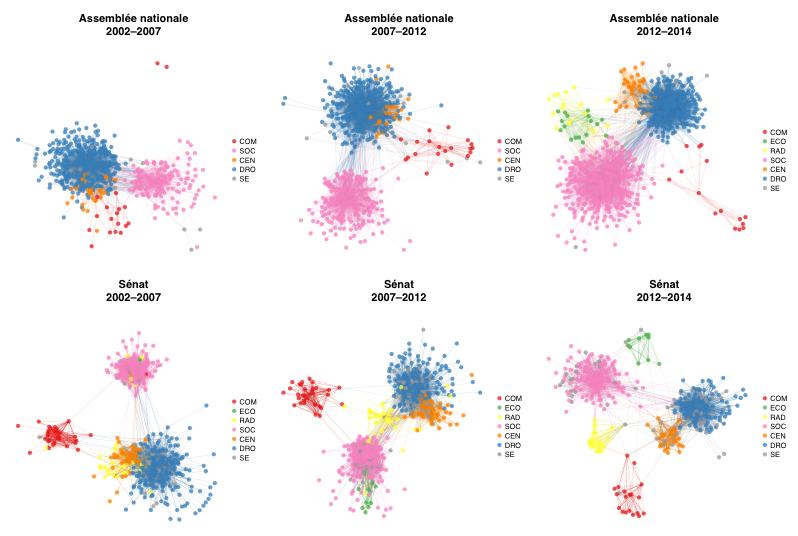

This repository plots legislative cosponsorship networks in the French Parliament. Its preliminary results were presented at [Open Legislative Data Politics](http://www.lafabriquedelaloi.fr/conference/) I (2012) and II (2014) in Paris.

See the [interactive visualization](http://briatte.org/parlement/) of the bill cosponsorships, the [simplified code behind it](https://github.com/briatte/parlement), or the [complete project](https://github.com/briatte/parlviz).

# DOCS

* [replication instructions](HOWTO.md)
* [data codebooks](data/README.md)
* [model specifications](models/README.md)

# THANKS

* [Authueil][authueil] and [Benjamin][roux] from [Regards Citoyens][rc] for comments
* [Baptiste Coulmont](http://coulmont.com/blog/2011/09/02/travail-de-deputes/) for inspiration
* [Bram][bram] and [Stef][stef] for help with [XPath](http://www.w3.org/TR/xpath/)
* James Fowler for [model data](http://jhfowler.ucsd.edu/cosponsorship.htm)
* Erik Gregory for [PostgreSQL R functions](http://anrprogrammer.wordpress.com/2013/07/27/easier-database-querying-with-r/)
* [Mason Porter](http://people.maths.ox.ac.uk/porterm/) for replication material
* [Pedro Jordano](https://pedroj.github.io/bipartite_plots/) and [Moritz Marbach](https://sumtxt.wordpress.com/2011/07/02/visualizing-networks-with-ggplot2-in-r/) for graph visualization
* [Tore Opsahl](http://toreopsahl.com/2010/04/21/article-node-centrality-in-weighted-networks-generalizing-degree-and-shortest-paths/) for network weighting routines
* Sébastien Dubourg and the rest of the [Data Sénat](http://data.senat.fr/) team

[authueil]: https://twitter.com/Authueil
[bram]: https://github.com/Psycojoker
[stef]: https://github.com/stef
[rc]: http://www.regardscitoyens.org/
[roux]: http://www.medialab.sciences-po.fr/people/benjamin-ooghe-tabanou/
